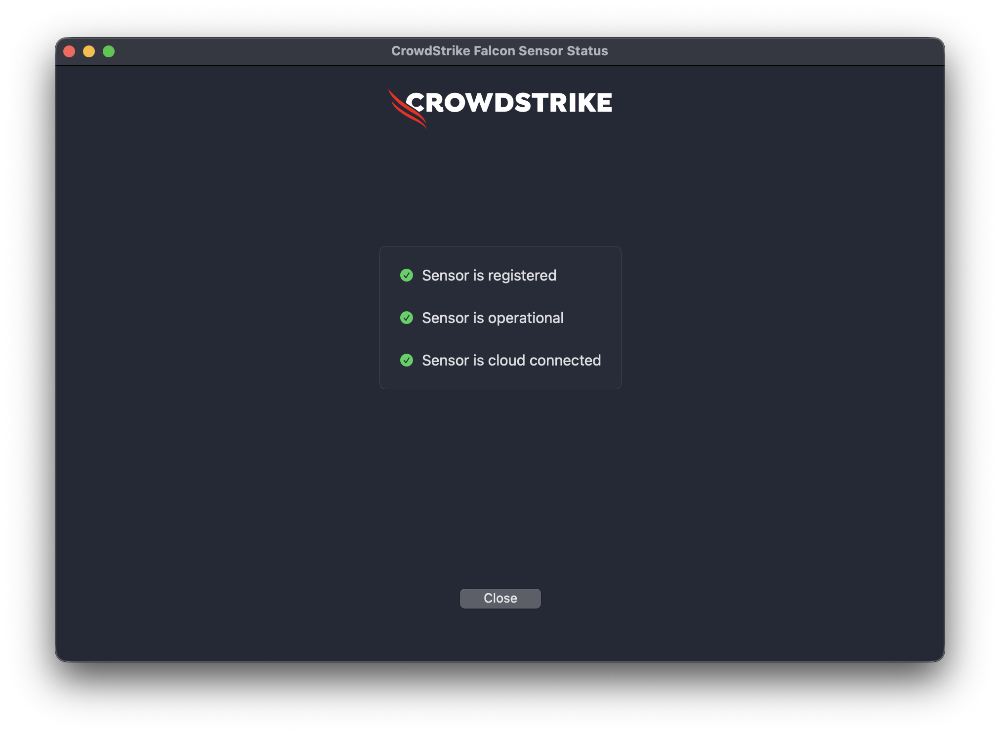

# CrowdStrike Falcon Enrollment

## 📝 Description
This script automates the licensing and initial configuration of the **CrowdStrike Falcon** sensor on macOS. It is intended to be run immediately after the Falcon agent (`.pkg`) has been deployed to the device.

## ⚙️ How it works
1. **Validation:** Checks if `falconctl` exists in the system.
2. **Licensing:** Applies the Customer ID (CID) to the sensor.
3. **Tagging:** (Optional) Assigns a grouping tag to the device for automatic policy grouping within the CrowdStrike console.
4. **Service Refresh:** Unloads and reloads the sensor to ensure all changes take effect immediately.

## 🛠 Variables to Customize
| Variable | Description | Example |
| :--- | :--- | :--- |
| `CID` | Your Customer ID checksum (found in Falcon Console > Sensor Downloads). | `12345ABC...-01` |
| `GROUPING_TAG` | Optional tag for host grouping. | `Internal-Marketing` |

## 📋 Requirements
- **Platform:** macOS.
- **Dependency:** The CrowdStrike Falcon sensor must be already installed.
- **Privileges:** Must run as `root` (Applivery default).

## 🚀 Applivery Deployment Notes
For a seamless deployment, we recommend:
1. Deploying the CrowdStrike Falcon `.pkg` using **Applivery App Management**.
2. Setting this script to run as a **Post-Install script** or as a separate **Custom Script** triggered after installation.
3. **Important:** Remember that macOS may require a **Configuration Profile (MDM)** to approve System Extensions and Content Filters for CrowdStrike to function without user intervention.

## Success prove

---
*Part of the [Applivery Community Scripts](https://github.com/applivery/community-scripts) collection.*